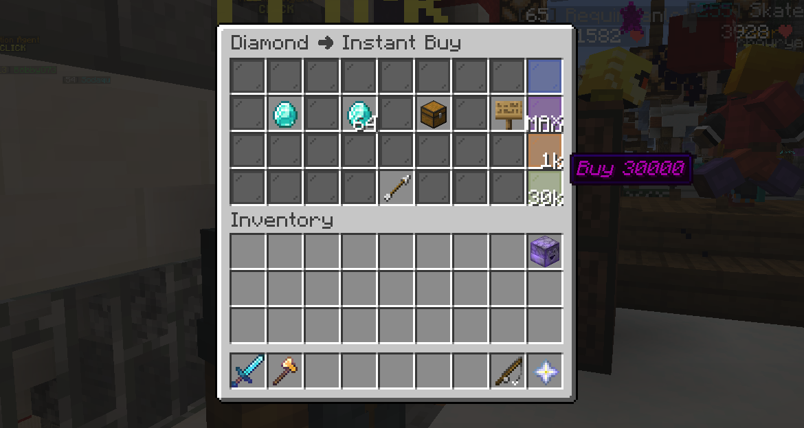
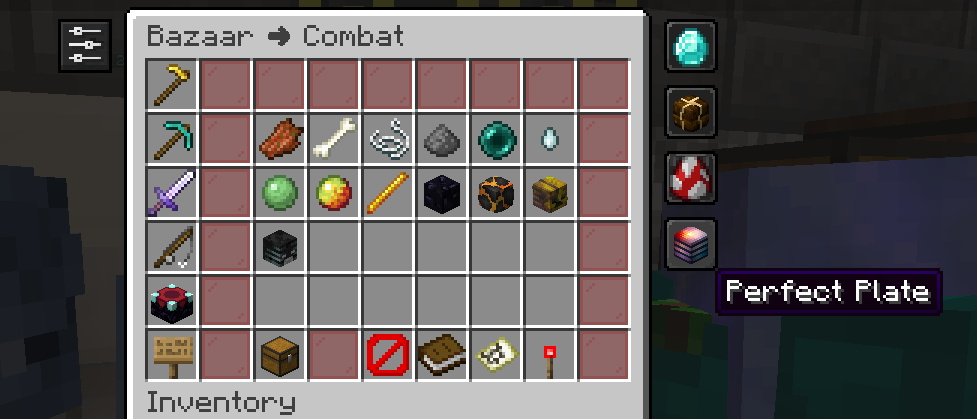
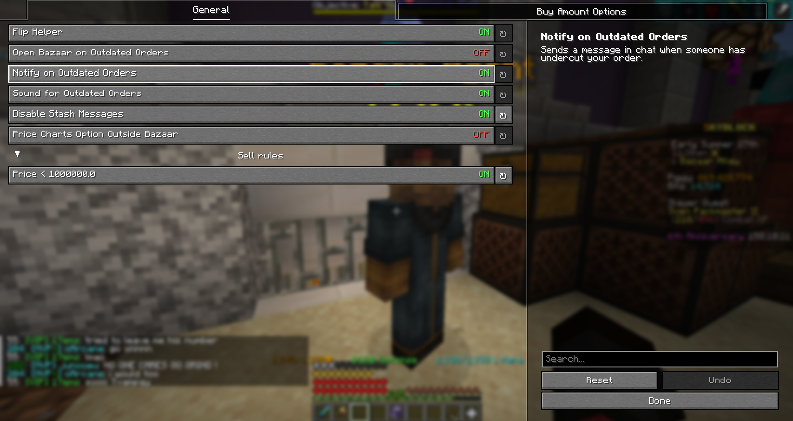
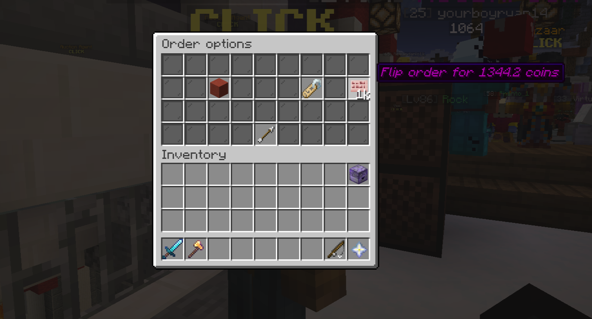
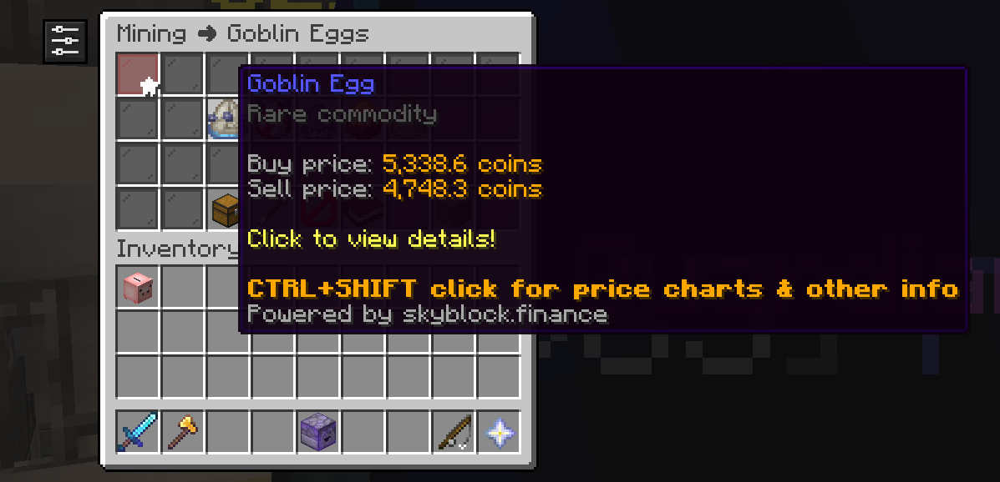
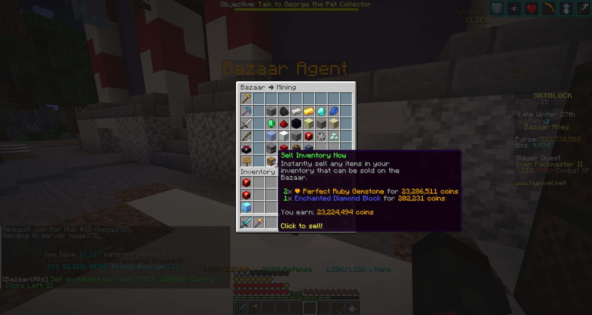

# Bazaar Utils

[](https://discord.gg/xDKjvm5hQd)
[](https://modrinth.com/mod/bazaar-utils)
[](https://github.com/mkram17/Bazaar-Utils/releases)


A Fabric client-side QoL mod for the Hypixel SkyBlock Bazaar.

## Features

<details>
<summary><strong>Buttons & Input Helpers</strong></summary>

- **Custom Buy Amounts**: Add quick-buy buttons to the Buy Order and Instant Buy screens for the amounts you use most. Each button has its own amount, inventory slot, and colored pane, and clicking one opens the sign with the amount already filled in.
- **Max Buy Order**: A built-in custom order button that reads your purse and fills in the largest amount you can currently afford (capped at the Bazaar's 71,680 limit).
- **Flip Helper**: A one-click button (the cherry sign) in the flip GUI that re-prices an order for you. Choose whether it prices **Competitive** (just beats the best order), **Matched** (equal to the best order), or **Outbidded**.
- **Settings Button**: A widget button on Bazaar screens that opens the Bazaar Utils config without typing a command.
- **Open Orders Button**: A widget button that jumps straight to your Bazaar orders page (requires an active Booster Cookie).

</details>

<details>
<summary><strong>Bookmarks</strong></summary>

- **Bookmarks**: Bookmark an item from its Bazaar page with a single button, then re-search it from the Bazaar main page. Bookmark widgets show the current buy and sell price in their tooltip.

</details>

<details>
<summary><strong>Inventory</strong></summary>

- **Sell Rules**: Lock the Bazaar's **Instant Sell** button behind multiple confirmation clicks (default 3) when your inventory matches a rule. Rules can match on total **price**, item **volume**, or item **name**, and the button shows how many clicks are left.

</details>

<details>
<summary><strong>Overlays</strong></summary>

- **Order Status Highlight**: Colors your orders in the Bazaar orders GUI by status — **competitive** (best on the market), **matched** (equal to market price), or **outbid** — and adds the status plus the current market price to the tooltip.
- **Bazaar Order Limit**: Shows how close you are to the daily Bazaar coin limit (15 billion by default, resets at 12am GMT) at the top of Bazaar screens. The limit is configurable.
- **Price Charts**: `Ctrl + Shift + Click` an item in the Bazaar to open its charts and market info on skyblock.finance, with a confirmation screen before you're redirected. Can optionally be enabled outside the Bazaar too.

</details>

<details>
<summary><strong>Notifications</strong></summary>

- **Outbid Order Notifications**: Get told when one of your orders is undercut. Independently toggle a clickable chat message, three short notification sounds, and automatically opening the Bazaar after a short delay.
- **Order Filled Sound**: Plays two short notification sounds when one of your orders fills.
- **Error Notifications**: On by default so problems are visible; can be turned off if you hit error spam.

</details>

<details>
<summary><strong>Chat</strong></summary>

- **Disable Stash Messages**: Suppress the chat reminders telling you to pick up your stash.

</details>

<details>
<summary><strong>Keybinds</strong></summary>

- **Stash Helper**: Press a keybind (default `V`) to close the current GUI and pick up your stash.

</details>

<details>
<summary><strong>Other</strong></summary>

- **Bazaar Tax Setting**: Set your Bazaar tax so flip pricing and profit math stay accurate with your Bazaar Flipper upgrade.
- **Auto-Updating Item Data**: Bazaar item conversions are refreshed from GitHub on startup, and on demand with `/bu updateresources`.
- **Mod Menu Integration**: Open the config straight from Mod Menu.
- **Mod Compatibility Patches**: Detects and adjusts for REI, Skyblocker, and Firmament so their overlays don't fight with the Bazaar screens.
- **Developer Mode**: Optional debug commands and per-category debug messages.

</details>

<details>
<summary><strong>🖼️ Gallery</strong></summary>

**Custom Buy Amounts**

_Custom buy amount buttons (the glass panes on the right) are shortcuts for buying a set amount of an item in Buy Order or Instant Buy._

**Bookmarks**

_Bookmarked items appear on the right of the Bazaar main page. Clicking one searches for that item. To create a bookmark, click the button in the top left of an item's page._

**Settings**


**Flip Helper**

_The cherry sign button re-prices your order according to the bidding type you picked._

**Price Charts**

_Ctrl+Shift click an item in the Bazaar to open that item's skyblock.finance page. There is a confirmation screen before you are redirected._

**Sell Rules**

_Rules that stop you from instantly selling items in your inventory. Ex: a rule for "diamond" and a rule for price > 100,000 means selling requires three clicks whenever you're holding diamonds or the sell is worth more than 100,000 coins._

</details>

## Compatibility

- **Minecraft**: `26.1.2` and `26.2`
- **Java**: `21+` (the project itself builds with a JDK 25 toolchain)
- **Fabric Loader**: `0.16.9+`
- **Current mod version**: `0.6.2-beta.4`

## Using Bazaar Utils

- Open the config with `/bazaarutils` or `/bu`.
- If your Bazaar Flipper account upgrade is not level 1, set your tax with `/bu tax {percentage}` or pricing features won't be accurate.

### Other Commands

- `/bu help` — list the available commands
- `/bu tax {percentage}` — set your Bazaar tax (accepts `1`–`1.25`)
- `/bu discord` — open a link to join the Discord server
- `/bu customorder add {amount} {slot number}` — add a custom buy amount button (amount `1`–`71680`, slot `1`–`36`, where the top left slot is #1)
- `/bu customorder remove {order number}` — remove a custom buy amount button (numbered as shown in the config)
- `/bu rule add price|volume {limit}` / `/bu rule add name {item name}` — add a sell rule
- `/bu rule remove {rule number}` — remove a sell rule (numbered as shown in the config)
- `/bu updateresources` — check for and apply Bazaar item data updates
- `/bu developer` — toggle developer mode (you probably won't need this)

## Dependencies

### Required in your mods folder

- [Fabric API](https://modrinth.com/mod/fabric-api)
- [Yet Another Config Library](https://modrinth.com/mod/yacl)

### Optional

- [Mod Menu](https://modrinth.com/mod/modmenu)
- [Amecs Reborn](https://modrinth.com/mod/amecs-reborn)

### Bundled with Bazaar Utils

- Orbit Event System
- Mixin Constraints
- Hypixel API Transport/Core (and the Apache HttpClient dependencies Minecraft no longer ships)
- Gson Extras

## Building

The project uses [Stonecutter](https://stonecutter.kikugie.dev/) to build against multiple Minecraft versions from a single source set. Each target is a subproject under `versions/`, with its own dependency versions in `versions/<mc version>/gradle.properties`. The version used for development runs is set in `stonecutter.gradle.kts`.

```bash
./gradlew build         # build every configured version (jars land in versions/*/build/libs)
./gradlew :26.2:build   # build a single version
```

## Contributing

Pull requests should target `modern`. See [CONTRIBUTING.md](CONTRIBUTING.md) for conventions, or ask in the [Discord server](https://discord.gg/xDKjvm5hQd).
